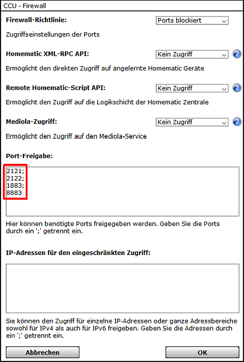
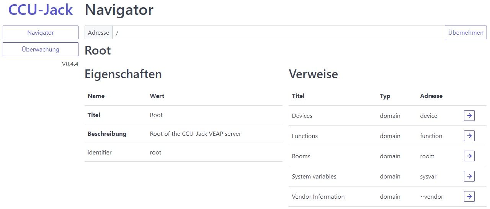
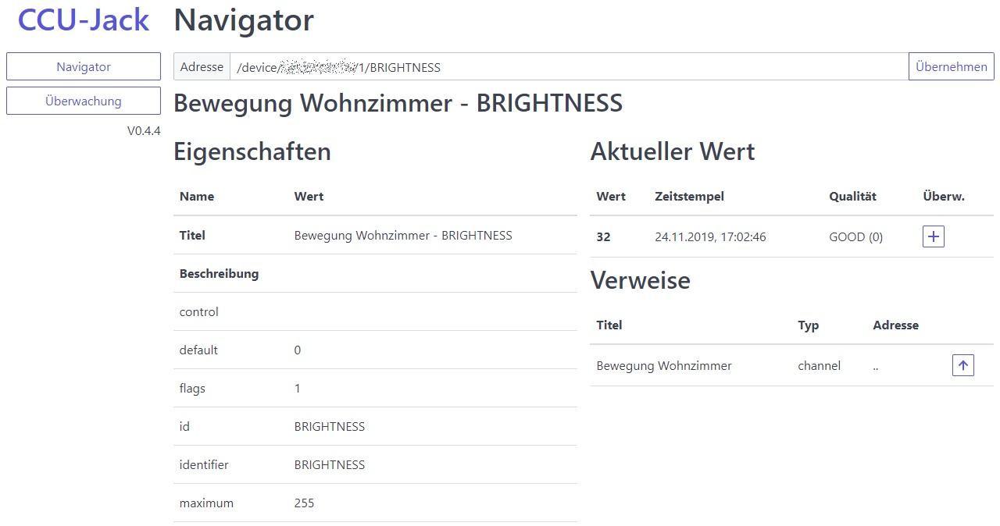

# CCU-Jack

CCU-Jack bietet einen einfachen und sicheren **REST**- und **MQTT**-basierten Zugriff auf die Datenpunkte der Zentrale (CCU) des [Hausautomations-Systems](http://de.wikipedia.org/wiki/Hausautomation) HomeMatic der Firma [eQ-3](http://www.eq-3.de/). Er implementiert dafür das [Very Easy Automation Protocol](https://github.com/mdzio/veap), welches von vielen Programmiersprachen leicht verwendet werden kann, und das [MQTT-Protokoll](https://de.wikipedia.org/wiki/MQTT), welches im Internet-of-Things weit verbreitet ist.

## Hauptmerkmale

Folgende Merkmale zeichnen CCU-Jack aus:
* Lese- und Schreibzugriff auf alle Gerätedatenpunkte und Systemvariablen der CCU.
* Alle Datenpunkte können über eine Baumstruktur erkundet werden.
* Umfangreiche Zusatzinformationen zu jedem Datenpunkt, z.B. Anzeigenamen, Räume, Gewerke, aber auch viele technische Informationen aus den XMLRPC-Schnittstellen und der ReGaHss.
* Hohe Performance und minimale Belastung der CCU-Prozesse (XMLRPC-Schnittstellen, ReGaHss, CCU Web-Server).
* Unterstützung von HTTP/2 und Verbindungssicherheit auf dem Stand der Technik.
* Vollständige Unterstützung von Cross-origin resource sharing (CORS) für die Anbindung von Web-Applikationen.
* Fertige Distributionen für viele Zielsysteme (CCU2, CCU3/RM, Windows, Linux, macOS).
* Die Verwendung des VEAP-Protokolls ermöglicht einfachste Anbindung von Applikationen und Frameworks (z.B. Angular, React, Vue). Zudem ist das Protokoll nicht CCU-spezifisch. Entwickelte Client-Applikationen könnnen auch mit anderen VEAP-Servern verwendet werden.
* Web-basierte Benutzerschnittstelle mit der alle Datenpunkte erkundet und die Werte überwacht werden können.

## Projekt

Ziel vom CCU-Jack ist es, möglichst einfach Datenpunkte zwischen CCUs und auch anderen Systemen auszutauschen und Applikationen eine Erkundungsmöglichkeit der Datenpunkte zu bieten. Der CCU-Jack wurde komplett neu entwickelt. Vorgänger vom CCU-Jack sind schon längere Zeit in Betrieb und tauschen hunderte von Datenpunkten zwischen mehreren CCUs, Internet-Relays und Front-Ends in Echtzeit aus.

### Fahrplan

Nach der Implementierung von MQTT sind zukünftig erst einmal kleinere Erweiterungen geplant, um den CCU-Jack für die V1.0 abzurunden:

* Erweiterungen für MQTT
  * Setzen von Gerätedatenpunkten und Systemvariablen
  * Unterstützung für Secure-MQTT und Websockets
  * Zugriffsberechtigungen
* Erweiterungen VEAP-API
  * Zugriffsberechtigungen
* Erweiterungen der Web-UI
  * Setzen von Datenpunkten im _Navigator_ und der _Überwachung_
  * Benutzer- und Rechteverwaltung

## Download

Distributionen für die verschiedenen Zielsysteme sind auf der Seite [Releases](https://github.com/mdzio/ccu-jack/releases) zu finden. 

Zurzeit besitzt CCU-Jack noch Beta-Status. Es sollten also vor der Verwendung Sicherheitskopien von den involvierten Systemen erstellt werden (z.B. System-Backup von der CCU).

### Installation als Add-On auf der CCU

Bei einer Installation als Add-On auf der CCU können die Startparameter in der Datei `/usr/local/etc/config/rc.d/ccu-jack` angepasst werden. In der Regel ist dies nicht notwendig. Log-Meldungen werden in die Datei `/var/log/ccu-jack.log` geschrieben.

In der Firewall der CCU müssen die zwei Ports 2121, 2122 und 1883 freigegeben werden:



## Bauen aus den Quellen

Der CCU-Jack ist in der [Programmiersprache Go](https://golang.org/) (Version 1.13) geschrieben. Alle Distributionen des CCU-Jacks können sehr einfach und schnell auf allen möglichen Plattformen (u.a. Windows, Linux, MacOS) gebaut werden. Im GOPATH-Verzeichnis, dieses wird bei der Installation von Go festgelegt, müssen dafür folgende Kommandos ausgeführt werden:
```
go get github.com/mdzio/ccu-jack
cd src/github.com/mdzio/ccu-jack/build
go run .
```

## Kommandozeilenoptionen

Die Kommandozeilenoptionen vom CCU-Jack werden beim Start mit der Option `-h` aufgelistet:
```
usage of ccu-jack:
  -addr address
    	address of the host (default "127.0.0.1")
  -ccu address
    	address of the CCU (default "127.0.0.1")
  -cors host
    	set host as allowed origin for CORS requests (default "*")
  -host name
    	host name for certificate generation (normally autodetected)
  -http port
    	port for serving HTTP (default 2121)
  -https port
    	port for serving HTTPS (default 2122)
  -id identifier
    	additional identifier for the XMLRPC init method (default "CCU-Jack")
  -interfaces types
    	types of the CCU communication interfaces (comma separated): BidCosWired, BidCosRF, System, HmIPRF, VirtualDevices (default BidCosRF)
  -log severity
    	specifies the minimum severity of printed log messages: off, error, warning, info, debug or trace (default INFO)
  -logfile file
    	write log messages to file instead of stderr
  -mqtt port
    	port for serving MQTT (default 1883)
  -password password
    	password for HTTP Basic Authentication, q.v. -user
  -user name
    	user name for HTTP Basic Authentication (disabled by default)
```

Log-Meldungen werden auf der Fehlerausgabe (STDERR) oder in die mit der Option `-logfile` angegebenen Datei ausgegeben, wenn sie mindestens die mit der Option `-log` gesetzte Dringlichkeit besitzen.

## Performance

Folgende Angaben gelten für eine Installation als Add-On auf einer CCU3 (Raspberry Pi 3B):
* 1,7 Millisekunden Latenz für das Lesen eines Datenpunktes.
* 8.800 Datenpunkte können von 100 Clients pro Sekunde gesichert mit HTTPS-Verschlüsselung gelesen werden.

## Web-basierte Benutzerschnittstelle

Die web-basierte Benutzerschnittstelle des CCU-Jacks ist über die Adressen `http://<host>:2121/ui` und `https://<host>:2122/ui` zu erreichen. `<host>` ist durch den Rechnernamen oder die IP-Adresse des Rechners zu ersetzen, auf dem CCU-Jack gestartet worden ist. Wenn es der lokale Rechner ist, kann auch `localhost` verwendet werden.

Mit Hilfe des Navigators können alle verfügbaren Datenpunkte erkundet werden:



Bei Variablen wird ebenfalls der Wert angezeigt und aktuell gehalten:



Variablen können für die Überwachung ausgewählt werden. Es werden in Echtzeit die aktuellen Werte angezeigt und Wertänderungen hervorgehoben:


## Beschreibung der VEAP-Dienste/REST-API

Mit dem [Kommandozeilenwerkzeug CURL](https://curl.haxx.se), das praktisch für alle Betriebssysteme und Plattformen verfügbar ist, können alle VEAP-Dienste (z.B. Datenpunkte lesen und setzen) des CCU-Jacks genutzt werden. Die Beschreibung ist auf einer [eigenen Seite](https://github.com/mdzio/ccu-jack/blob/master/doc/curl.md) zu finden.

## Beschreibung der MQTT-Schnittstelle

Der CCU-Jack enthält einen vollwertigen und leistungsfähigen MQTT-Broker (V3.1.1). Dieser kann von beliebigen Fremdapplikationen genutzt werden. Zudem werden die Wertänderungen aller Gerätedatenpunkte der CCU unter dem Topic `device/Seriennr./Kanalnr./Parametername` publiziert. Das Nachrichtenformat ist JSON und entspricht dem [VEAP-Protokoll](https://github.com/mdzio/veap/blob/master/README_de.md#datenpunkt-lesen).

Die Retain-Eigenschaft wird bei allen Datenpunkten gesetzt, außer der Parametername ist *INSTALL_TEST* oder beginnt mit *PRESS_*.

Hinweis: Die MQTT-Schnittstelle befindet sich zurzeit noch in der Entwicklung. Das Setzen von Datenpunkten ist noch nicht implementiert, und die Topic-Struktur kann sich noch ändern. Zudem findet noch keine Benutzerauthentifizierung statt.

## Anwendungsbeispiel Android App _HTTP Shortcuts_

CCU-Jack ermöglicht der kostenlosen Android App _HTTP Shortcuts_ einfachen Zugriff auf die Datenpunkte der CCU. So können beispielsweise Geräte direkt vom Home-Screen geschaltet werden. Beispiele sind auf einer [eigenen Seite](https://github.com/mdzio/ccu-jack/blob/master/doc/httpshortcuts.md) zu finden.

## Sicherheit

### Cross-origin resource sharing (CORS)

Um fremden Web-Applikationen den Zugriff auf die VEAP-API des CCU-Jacks zu ermöglichen, wird CORS vollständig unterstützt. In der Standardkonfiguration werden alle anfragenden Quellen zugelassen (`Access-Control-Allow-Origin: *`). Falls die Authentifizierung eingeschaltet ist (s.a. Kommandozeilenoptionen `-user` und `-password`) muss die Anfragequelle explizit zugelassen werden. Dies erfolgt mit der Kommandozeilenoption `-cors`.

Beispiel: Die Web-Applikation auf dem Host `https://example.com` soll mit Authentifizierung auf die VEAP-API zugreifen können. Dafür muss die Kommandozeilenoption `-cors https://example.com` gesetzt werden.

### Sicherer Zugriff über HTTPS

CCU-Jack ermöglicht einen verschlüsselten Zugriff über HTTPS, sodass auch über unsichere Netzwerke (z.B. Internet) Daten sicher ausgetauscht werden könnan. Über den Port 2122 (änderbar mit der Kommandozeilenoption `-porttls`) kann eine HTTPS-Verbindung aufgebaut werden. Die dafür benötigten Zertifikate können vorgegeben werden oder werden beim ersten Start vom CCU-Jack automatisch generiert.

Benötigte Zertifikatsdateien für den Server:

Dateiname   | Funktion
------------|---------
svrcert.pem | Zertifikat des Servers
svrcert.key | Privater Schlüssel des Servers (Dieser ist geheim zu halten.)

Falls die oben genannten Zertifikatsdateien im Arbeitsverzeichnis des CCU-Jacks nicht vorhanden sind, so werden automatisch zwei Zertifikate erstellt. Die Gültigkeit ist auf 10 Jahre eingestellt:

Dateiname   | Funktion
------------|---------
cacert.pem  | Zertifikat der Zertifizierungsstelle (CA)
cacert.key  | Privater Schlüssel der Zertifizierungsstelle (Dieser ist geheim zu halten.)
svrcert.pem | Zertifikat des Servers
svrcert.key | Privater Schlüssel des Servers (Dieser ist geheim zu halten.)

Für den sicheren Zugriff muss lediglich das generierte Zertifikat der Zertifizierungsstelle (`cacert.pem`) den HTTPS-Clients *über einen sicheren Kanal* bekannt gemacht werden. Das Zertifikat kann z.B. im Betriebssystem oder im Web-Browser installiert werden. Die privaten Schlüssel dürfen nie verteilt werden.

Über verschiedene Programmiersprachen kann auch verschlüsselt zugegriffen werden.

### Curl

```bash
curl --cacert path/to/cacert.pem https://hostname:2122
```

### Python

```python
import requests
r = requests.get("https://hostname:2122", verify='path/to/cacert.pem')
print(r.status_code)
```

### Go

```go
caCert, err := ioutil.ReadFile("path/to/cacert.pem")
if err != nil {
    log.Fatal(err)
}
caCerts := x509.NewCertPool()
ok := caCerts.AppendCertsFromPEM(caCert)
if !ok {
    log.Fatal("Failed to parse certificate")
}
con, err := tls.Dial("tcp", "hostname:2122", &tls.Config{RootCAs: caCerts})
if err != nil {
    log.Fatal(err)
}
defer con.Close()
```


### Javascript

```javascript
var fs = require('fs');
var https = require('https');

var get = https.request({
  path: '/', hostname: 'hostname', port: 2122,
  ca: fs.readFileSync('path/to/cacert.pem'),
  agent: false,
  rejectUnauthorized: true,
}, function(response) {
  response.on('data', (d) => {
    process.stdout.write(d);
  });
});
get.on('error', function(e) {
  console.error(e)
});
get.end();
```

## Lizenz und Haftungsausschluss

Lizenz und Haftungsausschluss sind in der Datei [LICENSE.txt](LICENSE.txt) zu finden.
