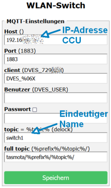
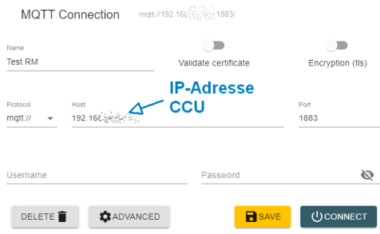
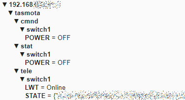
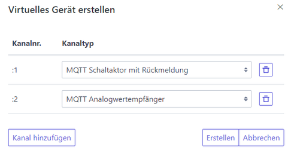
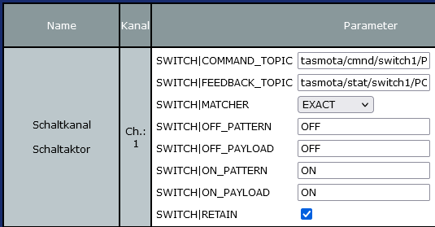
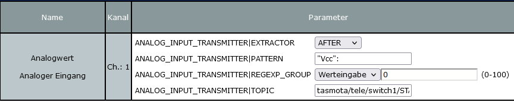

# Anbindung einer WLAN-Steckdose mit Tasmota-Firmware

## Voraussetzungen

Folgende Schritte sind einmalig auszuführen:

* Installation IISM-CCU-Api als Add-On auf der CCU3 oder RaspberryMatic
* Freischaltung der Ports 2121 und 1883 in der CCU-Firewall
* Akivierung von virtuellen Geräten in der Konfigurationsoberfläche des IISM-CCU-Apis (Web-UI CCU → Einstellungen → Systemsteuerung → IISM-CCU-Api → Konfiguration → CCU-Anbindung → Virtuelle Geräte aktivieren)

Hilfreiche Werkzeuge:
* [MQTT Explorer](https://mqtt-explorer.com/)

## Konfiguration WLAN-Steckdose

* Die WLAN-Steckdose, wie in der Tasmota-Dokumentation beschrieben, in das eigene Netzwerk einbinden.
* Die IP-Adresse der CCU als MQTT-Server in der Konfiguration eintragen. (Später können noch Zugangsdaten eingerichtet werden.)

Beispiel:

## MQTT Explorer

Im _MQTT Explorer_ können die gesendeten MQTT-Nachrichten der WLAN-Steckdose betrachtet werden. Dazu muss eine Verbindung zum MQTT-Server auf der CCU aufgebaut werden:

Der Topic-Baum der WLAN-Steckdose ist aus folgendem Bild ersichtlich:

## Virtuelles Gerät im IISM-CCU-Api anlegen

In der Web-UI des IISM-CCU-Apis unter _Virtuelle Geräte_ ein neues Gerät mit folgenden Kanälen erstellen und die Konfiguration speichern:

Mit dem _MQTT Analogwertempfänger_ soll die Betriebsspannung ausgelesen werden. Es können bis zu 32 weitere Kanäle angelegt werden, um auch komplexe Geräte abzubilden.

## Geräteposteingang der CCU

Um zum Geräteposteingang der CCU zu gelangen oben rechts in der Web-UI der CCU auf _Geräte anlernen_ klicken, danach im erscheinenden Dialog auf _Posteingang (1)_. Bei dem Gerät _Fertig_ anklicken. In der Geräteliste der CCU sollte nun das neue virtuelle Gerät mit aufgelistet werden.

## Virtuelles Gerät konfigurieren

Die zwei angelegten Kanäle des virtuellen Gerätes müssen noch über die Web-UI der CCU konfiguriert werden. Die Einstellungen des virtuellen Gerätes in der CCU Web-UI aufrufen: _Einstellungen_ → _Geräte_ → Geräte auswählen → _Einstellen_.

### Kanal für Schaltaktor (1. Kanal)

Folgende Parameterkonfiguration ist zu setzen:

Parameter      | Wert
---------------|------------
COMMAND_TOPIC  | tasmota/cmnd/switch1/POWER
FEEDBACK_TOPIC | tasmota/stat/switch1/POWER

Die restliche Konfiguration ist aus folgendem Bild ersichtlich:

## Kanal für Messwert (2. Kanal)

Folgende Parameterkonfiguration ist zu setzen:

Parameter      | Wert
---------------|------------
TOPIC          | tasmota/tele/switch1/STATE

Die restliche Konfiguration ist aus folgendem Bild ersichtlich:

_Hinweis: Wenn die Parameterwerte erneut betrachtet werden, so werden die " (doppelten Hochkommas) auf Grund eines Fehlers in Web-UI der CCU durch HTML-Sonderzeichen ersetzt (s.a. [Hinweis in der Beschreibung der virtuellen Geräte](virtual-devices.md#virtuelle-geräte-im-iism-ccu-api))._

## Abschluss

Damit ist die WLAN-Steckdose über die Web-UI bedienbar und kann wie ein HM-Gerät auch innerhalb von CCU-Programmen verwendet werden. Weitere Informationen zu den virtuellen Geräten sind in der IISM-CCU-Api Dokumentation zu finden (Kapitel ["Virtuelle Geräte"](https://github.com/IISM-IT-Consulting/iism-ccu-api#virtuelle-geräte) und Kapitel ["Virtuelle Geräte im IISM-CCU-Api"](virtual-devices.md))

